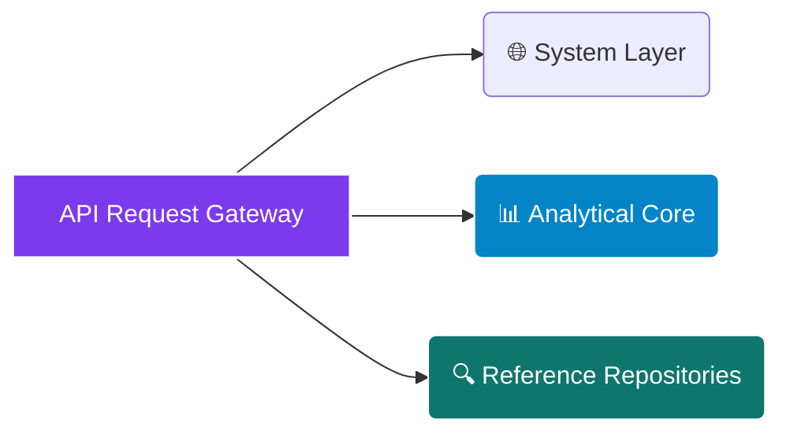

# <p align="center"></p>

<div align="center">

  <p><strong>Deterministic Commercial Building Energy Screening, Multi-Jurisdiction Building Performance Standards (BPS) Underwriting, and Capital Retrofit Optimization Engine</strong></p>

</div>

<div align="center">

  <a href="https://rapidapi.com/bethelnedi/api/energy-audit-automation-api"></a>
  <a href="https://elements.stoplight.io/viewer/?spec=https://raw.githubusercontent.com/bethelhash/Energy-Audit-Automation-API/refs/heads/main/openapi.json"></a>
  
  
  

</div>

---

## ⚡ Executive Summary

The **Energy Audit Automation API** is an audit-grade computational engine purpose-built to quantify financial exposure under active Building Performance Standards (BPS) across major US municipal markets. Moving beyond black-box projections, this engine acts as an instantaneous pre-screening and compliance gate for property managers, real estate investment trusts (REITs), sustainability teams, and commercial due diligence workflows.

By ingesting basic structural characteristics and utility data, the engine handles concurrent regulatory screenings for **NYC Local Law 97**, **Boston BERDO 2.0**, and **Energize Denver** frameworks. It projects liability cliffs across active compliance horizons while calculating carbon intensities, rooftop solar mitigation deductions, and prioritized energy conservation measures (ECMs) in **under 500ms**.

<blockquote align="left">

  <strong>💎 AUDIT-READY REGULATORY DEFENSE</strong><br>

  Developed to meet strict institutional reporting requirements, this infrastructure engine removes analytical ambiguity. Every calculated index—whether an energy split ratio derived from DOE CBECS or a grid carbon intensity sourced from EPA eGRID profiles—maps directly back to an explicit statutory table or peer-reviewed standard, establishing an unshakeable chain of custody for real estate asset filings.

</blockquote>

---

## 🏛️ Enterprise Core Capabilities

<table width="100%">
  <tr>
    <td width="50%" valign="top">
      <h3>📈 Dynamic BPS Exposure Underwriting</h3>
      <ul>
        <li><strong>Multi-Jurisdiction Matrix Execution:</strong> Evaluates building files concurrently against NYC LL97 carbon caps, Boston BERDO 2.0 emissions curves, and Denver’s kBtu target structures.</li>
        <li><strong>The 2030 Liability Horizon:</strong> Computes future carbon cap drawdowns (which drop by ~50% in 2030) to expose structural non-compliance long before fines are issued.</li>
        <li><strong>Billing Imputation Core:</strong> Uses localized DOE CBECS 2018 algorithms to break down raw utility spend into electricity and gas profiles when exact consumption is unknown.</li>
      </ul>
    </td>
    <td width="50%" valign="top">
      <h3>🔌 Capital Retrofit Optimization</h3>
      <ul>
        <li><strong>Ranked ECM Intelligence:</strong> Generates targeted, prioritized upgrade measures matching ASHRAE 90.1-2019 and DOE Better Buildings parameters, complete with exact payback and ROI profiles.</li>
        <li><strong>Distributed Solar Arbitrage:</strong> Models rooftop solar generation offsets and tracks specialized regulatory allowances, such as the LL97 DER deduction credit.</li>
        <li><strong>Regional eGRID Mapping:</strong> Applies local power distribution boundaries (e.g., NYISO, ISONE, PJM, WECC_CO) to accurately calculate actual operational CO₂e emissions.</li>
      </ul>
    </td>
  </tr>
</table>

---

## 🗺️ Market Architecture Hub

### 🌍 Active BPS Jurisdictional Frameworks
The compliance layer maps energy consumption directly to statutory liability rules across active legal jurisdictions:
`NYC Local Law 97 ($268/tCO₂e)` &middot; `Boston BERDO 2.0 ($234/tCO₂e + $1k/day)` &middot; `Energize Denver ($0.30/kBtu)`

### 📊 Supported Property Frameworks
Benchmarks match national energy and emissions criteria across 17 distinct commercial building classes:
`office` &middot; `retail` &middot; `hotel` &middot; `multifamily` &middot; `warehouse` &middot; `hospital` &middot; `school` &middot; `data_center` &middot; `manufacturing` &middot; `laboratory` &middot; `supermarket` &middot; `worship` &middot; `dormitory` &middot; `courthouse` &middot; `bank` &middot; `restaurant` &middot; `fitness`

---

## 📂 API Core Endpoint Directory



---

### 🌐 System Layer

* `GET /health` — Verifies engine uptime, outputs current microservice builds, and confirms regulatory dataset synchronization.
* `GET /pricing` — Returns active platform tier restrictions, execution rate limits, and product feature inclusions.

### 📊 Analytical Core

* `POST /audit/quick` — Fast screening node. Ingests floor area, asset type, and raw monthly utility spend to map approximate Site EUI metrics, baseline benchmark performance, and high-level 2030 compliance alerts. *(Free Tier)*
* `POST /audit/full` — Deep institutional underwriting pipeline. Processes exact annual metered utility inputs (kWh/therms), specific electrical grid zones, and usable roof envelopes to generate precise carbon emission matrices, multi-city statutory penalty structures, and actionable ECM financial roadmaps. *(Pro Tier)*

### 🔍 Reference Repositories

* `GET /reference/property-types` — Streams the list of supported building categories alongside corresponding EPA national median EUI baselines.
* `GET /reference/cities` — Details active municipal BPS parameters, target metrics, structural square-footage thresholds, and statutory citations.
* `GET /reference/ll97-limits` — Exposes exact NYC carbon coefficient limits per property type across current and 2030 horizons.
* `GET /reference/benchmarks` — References the absolute EPA ENERGY STAR Portfolio Manager empirical data tables (August 2024 Reference).
* `GET /reference/carbon-factors` — Streams verified EPA eGRID emissions factors and specific statutory combustion coefficients.

---

## 📈 Engineering Methodology & Verification Matrix

The engine maps every computational layer to official government data sheets and municipal legal codes to pass engineering peer review:

| Analytical Layer | Governing Framework / Code | Primary Regulatory / Empirical Reference Source Citation |
| --- | --- | --- |
| **National EUI Baselines** | EPA Benchmarking Table | ENERGY STAR Portfolio Manager Technical Reference (August 2024 Release) |
| **NYC Carbon Limits** | NYC Administrative Code | §28-320.3.3 & 1 RCNY §103-14 Table 1 Emissions Coefficients |
| **Boston BPS Evaluation** | Boston Municipal Code | §7-2.2 Building Energy Reporting and Disclosure Ordinance (BERDO 2.0) |
| **Denver EUI Targets** | Denver Municipal Code | §§4-38 et seq. Energize Denver Commercial Infrastructure Mandate |
| **Grid Intensity Metrics** | EPA eGRID Dataset | 2022 Output Emission Rates (Table 2 Subregion Factor Sets) |
| **Natural Gas Emissions** | EPA Greenhouse Gas Core | 40 CFR Part 98 Table C-1 Carbon Densities (53.06 kgCO₂/MMBtu) |
| **Energy Consumption Splits** | Imputation Modeling | DOE Commercial Buildings Energy Consumption Survey (CBECS 2018 Data) |
| **Upgrade Savings Margins** | Efficiency Performance | ASHRAE Standard 90.1-2019 Core Efficiency Engineering Parameters |
| **Retrofit Capital Costing** | Capital Expenditure Ranges | DOE Better Buildings Initiative Cost and Performance Valuation Ledger |

---

## 🚀 Quickstart Integration Example (Python)

To run a full multi-city regulatory screening using verified asset utility consumption records, deploy the script layout below:

```python
import json
import requests

# Core Routing Configuration via RapidAPI Gateway
GATEWAY_URL = "[https://energy-audit-automation-api.p.rapidapi.com/audit/full](https://energy-audit-automation-api.p.rapidapi.com/audit/full)"

payload = {
    "property_type": "office",
    "sq_ft": 75000,
    "annual_kwh": 1250000,
    "annual_therms": 8500,
    "city": "all",
    "grid_region": "NYISO",
    "climate_zone": "mixed",
    "roof_pct": 0.40,
    "elec_rate": 0.126
}

headers = {
    "Content-Type": "application/json",
    "X-API-Key": "YOUR_SECURE_MARKETPLACE_TOKEN",
    "X-RapidAPI-Host": "energy-audit-automation-api.p.rapidapi.com"
}

response = requests.post(GATEWAY_URL, json=payload, headers=headers)
print(json.dumps(response.json(), indent=2))

```

---

## 💎 Production Access Tiers

| Tier Classification | Monthly Access Fees | Active Rate Latency Caps | Inclusive Data Volume Quota | Programmatic Endpoint Access | Support Service Level |
| --- | --- | --- | --- | --- | --- |
| **Free Tier Core** | $0 / Month | 5 Requests / Minute | Sandbox Evaluation Bounds | `/audit/quick` + Reference Repositories | Open Community Forum |
| **Pro Enterprise** | $99 / Month | 1,000 Requests / Hour | Unlimited Volume Quota | Full `/audit/full` Analysis Suite | Standard Service SLA |
| **Ultra Institutional** | $299 / Month | 1,000 Requests / Hour | Unlimited Volume Quota | Full Access + Full White-Label Rights | Dedicated Operations SLA |

* **Platform Tool Access & Sandboxes:** Pro and Ultra tiers unlock direct key validation on the [BuildingIQ UI Portal (buildingiq-nu.vercel.app)](https://buildingiq-nu.vercel.app/). Entering an active Pro token generates complete asset upgrade roadmaps, interactive penalty tracking models, and printable compliance summary reports.
* **White-Label Integration Deployment:** Ultra tier subscribers gain structural rights to remove native branding metrics and frame the interactive design framework directly on corporate engineering domains or manufacturer client web spaces (subject to a 1-day deployment domain validation).

---

## 🔒 Proprietary License & Terms

### Intellectual Property Protection

**Copyright © 2026 Axiom Infrastructure Intelligence LLP. All rights reserved.**

The Energy Audit Automation API, its underlying baseline consumption estimators, cross-jurisdictional financial penalty frameworks, multi-city regulatory rulesets, data layers, and open schema designs are the exclusive proprietary intellectual property of Axiom Infrastructure Intelligence LLP. No part of this interface map, processing logic, or endpoint schema may be replicated, redistributed, white-labeled, reverse-engineered, or modified without an executed Master Services Agreement (MSA) and explicit written licensing permission from the corporate rights holder.

### Technical Disclaimer

All emission indexes, consumption estimates, and financial liabilities generated by this engine serve as top-of-funnel feasibility pre-screens and screening tools. Real estate professionals must consult an accredited energy auditor, a licensed professional mechanical engineer, and qualified tax or legal advisors to confirm statutory compliance before executing capital improvements or filing official municipal reports.

```

```
